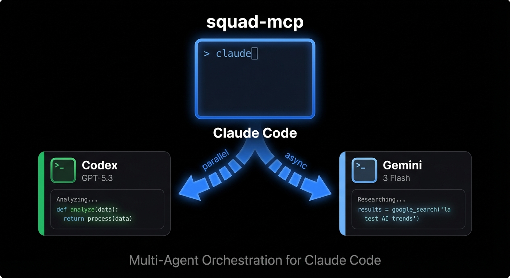

# Squad MCP Server

**Multi-agent orchestration for Claude Code** — dispatch tasks to Codex and Gemini simultaneously.



One prompt. Multiple AI perspectives. All in your terminal.

## Features

- **Parallel execution** — Run Codex (GPT-5.3) and Gemini 3 in parallel via MCP tools
- **tmux-based** — Each agent runs in its own tmux session, visible in real-time
- **Pane layout** — Agents auto-arrange as tmux panes alongside Claude Code
- **Instance isolation** — Multiple Claude Code sessions don't interfere with each other
- **Configurable** — Choose models, reasoning levels, display modes via `config/settings.json`

## Quick Start

```bash
# Install dependencies
bun install

# Add to Claude Code
claude mcp add -s user squad -- bun run /path/to/squad/src/index.ts
```

## Requirements

- [Bun](https://bun.sh/) — JavaScript runtime
- [tmux](https://github.com/tmux/tmux) — Terminal multiplexer
- [Codex CLI](https://github.com/openai/codex) — OpenAI Codex
- [Gemini CLI](https://github.com/google/gemini-cli) — Google Gemini
- Terminal emulator (alacritty, kitty, wezterm, etc.) — for `display: "terminal"` mode

## Tools

| Tool | Parameters | Description |
|------|-----------|-------------|
| `codex` | `message`, `workDir` | Single Codex call (model + reasoning from settings) |
| `gemini` | `message`, `workDir`, `model?` | Single Gemini call (model from settings or parameter) |
| `codex_gemini` | `message`, `workDir`, `gemini_model?` | Parallel Codex + Gemini (consensus / dual perspective) |
| `parallel_search` | `queries`, `workDir` | 4 agents (2 Gemini + 2 Codex) researching different queries |
| `cleanup` | — | Kill all agent sessions owned by this instance |
| `poll_events` | `agent`, `peek?` | Poll pending events from an agent |
| `wait_for_event` | `agent`, `eventType`, `timeoutMs?` | Block until a specific event arrives |
| `get_agent_status` | `agent` | Query agent connection state and activity |

## Configuration

Edit `config/settings.json` to customize:

```json
{
  "codex": {
    "model": "gpt-5.3-codex",
    "reasoning": "xhigh"
  },
  "gemini": {
    "model": "gemini-3-flash-preview"
  },
  "terminal": "alacritty",
  "display": "pane"
}
```

After changes, reconnect the MCP server in Claude Code:
```
/mcp
```

### Available Values

| Setting | Values | Description |
|---------|--------|-------------|
| `codex.model` | `gpt-5.3-codex`, `gpt-5.2` | Codex model |
| `codex.reasoning` | `xhigh`, `high`, `medium`, `low` | Reasoning effort level |
| `gemini.model` | `gemini-3-flash-preview`, `gemini-3-pro-preview` | Gemini model |
| `terminal` | `alacritty`, `kitty`, `wezterm`, ... | Terminal emulator |
| `display` | `pane`, `terminal`, `none` | Agent display mode |

### Display Modes

| Mode | Description |
|------|-------------|
| `terminal` | Opens a new terminal window for each agent (default) |
| `pane` | Opens agents as tmux panes in the current session (auto-grid) |
| `none` | No visual UI — agents run in the background |

**Pane mode** is ideal when running Claude Code inside tmux. Agents auto-arrange in a grid layout:

```
2 agents:                        3+ agents:
┌──────────┬───────────┐         ┌──────────┬─────┬─────┐
│          │  Codex    │         │          │ A1  │ A2  │
│  Claude  ├───────────┤         │  Claude  ├─────┼─────┤
│  Code    │  Gemini   │         │  Code    │ A3  │ A4  │
│  (40%)   │  (60%)    │         │  (40%)   │   (60%)   │
└──────────┴───────────┘         └──────────┴───────────┘
```

### Environment Variables (optional override)

Priority: ENV > settings.json > default

| Variable | Description |
|----------|-------------|
| `SQUAD_CODEX_MODEL` | Codex model |
| `SQUAD_CODEX_REASONING` | Codex reasoning effort |
| `SQUAD_GEMINI_MODEL` | Gemini model |
| `SQUAD_TERMINAL` | Terminal emulator |
| `SQUAD_DISPLAY` | Display mode (`pane`, `terminal`, `none`) |

## Architecture

```
config/
└── settings.json           # User settings (model, reasoning, terminal, display)

src/
├── index.ts                # MCP server entry point
├── config/
│   └── agents.ts           # Agent configurations + display mode
├── core/
│   ├── tmux-manager.ts     # tmux session management + pane grid layout
│   ├── instance.ts         # MCP instance ID (session isolation)
│   ├── codex-session.ts    # Codex JSONL session reader
│   ├── gemini-session.ts   # Gemini JSON session reader
│   ├── response-parser.ts  # Response cleanup
│   └── session-watcher.ts  # File watching utilities
├── agents/
│   ├── codex.ts            # Codex agent
│   └── gemini.ts           # Gemini agent
└── tools/
    ├── codex-tools.ts      # Codex tool
    ├── gemini-tools.ts     # Gemini + parallel_search tools
    └── status-tools.ts     # poll_events, wait_for_event, get_agent_status, cleanup
```

### Key Design Decisions

- **tmux-based**: Each agent runs in a separate tmux session
- **Instance isolation**: Each MCP instance gets a unique ID — sessions never collide
- **Pane grid layout**: In `display: "pane"` mode, agents auto-arrange in a grid
- **Read-only agents**: Codex prompts include file modification restrictions
- **Bracketed paste**: Multiline input via `tmux paste-buffer -p`
- **Request ID system**: `[RQ-xxx]` / `[ANS-xxx]` markers for response matching
- **60 min timeout**: Maximum wait time per operation
- **30 min inactivity**: Unused sessions are automatically cleaned up
- **Instance-scoped cleanup**: `cleanup` only kills sessions owned by this instance

## Development

```bash
bun run start                  # Start MCP server
bun run build && bun run lint  # Build and lint
```

## License

MIT
