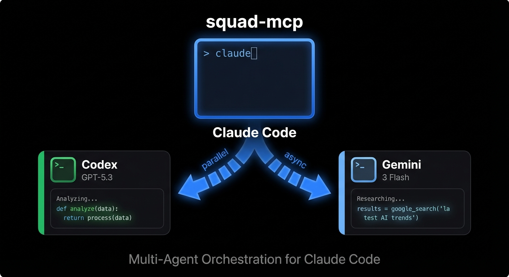

# Squad MCP Server

**Multi-agent orchestration for Claude Code** — dispatch tasks to Codex and Claude simultaneously.



One prompt. Multiple AI perspectives. All in your terminal.

## Features

- **Parallel execution** — Run Codex (GPT-5.5) and Claude (Opus 4.7 / Sonnet 4.6) in parallel via MCP tools
- **tmux-based** — Each agent runs in its own tmux session, visible in real-time
- **Pane layout** — Agents auto-arrange as tmux panes alongside Claude Code
- **Instance isolation** — Multiple Claude Code sessions don't interfere with each other
- **Model presets** — Simple preset names (medium/xhigh, opus/sonnet) instead of raw model strings
- **Live introspection** — Inspect semantic agent state, pane output, and active tmux sessions
- **Prompt recovery** — Common trust/onboarding prompts are auto-dismissed during startup and waits
- **Configurable** — Choose models, reasoning levels, display modes via `config/settings.json`

## Quick Start

```bash
# Install dependencies
bun install

# Add to Claude Code
claude mcp add -s user squad -- bun run /path/to/squad/src/index.ts
```

## Requirements

- [Bun](https://bun.sh/) — JavaScript runtime
- [tmux](https://github.com/tmux/tmux) — Terminal multiplexer
- [Codex CLI](https://github.com/openai/codex) — OpenAI Codex
- [Claude CLI](https://docs.anthropic.com/en/docs/claude-code) — Anthropic Claude Code
- Terminal emulator (alacritty, kitty, wezterm, etc.) — for `display: "terminal"` mode

## Tools

| Tool | Parameters | Description |
|------|-----------|-------------|
| `codex` | `message`, `workDir`, `allowFileEdits`, `model`, `waitForResponse?` | Codex call. All on `gpt-5.5`; `model` selects reasoning effort: `medium` (fast everyday), `xhigh` (deep reasoning + orchestration). Can queue async work with `waitForResponse: false`. |
| `claude` | `message`, `workDir`, `allowFileEdits`, `model`, `waitForResponse?` | Claude call. Presets: `opus` (claude-opus-4-7 + xhigh effort), `sonnet` (claude-sonnet-4-6). Can queue async work with `waitForResponse: false`. |
| `continue_agent` | `agent`, `message`, `allowFileEdits`, `waitForResponse?` | Send a follow-up prompt to an already running agent session |
| `task_graph` | `name`, `workDir`, `tasks[]`, `outputFile?`, `maxConcurrency?` | DAG of Claude workers — independent tasks run in parallel, dependents receive parent results |
| `list_agents` | — | List all available agent presets with live connection state and config |
| `list_sessions` | — | List active tmux sessions owned by this MCP instance |
| `get_agent_state` | `agent`, `lines?` | Semantic state summary: responding, awaiting confirmation, ready for input, etc. |
| `get_agent_output` | `agent`, `lines?` | Capture recent tmux pane output for debugging stalls or prompts |
| `poll_events` | `agent`, `peek?` | Poll pending events from an agent |
| `wait_for_event` | `agent`, `eventType`, `timeoutMs?` | Block until a specific event arrives |
| `get_agent_status` | `agent` | Query agent connection state and activity |
| `cleanup` | — | Kill all agent sessions owned by this instance |

## Configuration

Edit `config/settings.json` to customize:

```json
{
  "codex": {
    "model": "gpt-5.5",
    "reasoning": "xhigh"
  },
  "claude": {
    "model": "claude-opus-4-7"
  },
  "terminal": "alacritty",
  "display": "pane"
}
```

After changes, reconnect the MCP server in Claude Code:
```
/mcp
```

### Available Values

| Setting | Values | Description |
|---------|--------|-------------|
| `codex.model` | `gpt-5.5` | Codex model (single model; reasoning effort differentiates presets) |
| `codex.reasoning` | `xhigh`, `high`, `medium`, `low` | Reasoning effort level |
| `claude.model` | `claude-opus-4-7`, `claude-sonnet-4-6` | Claude model |
| `terminal` | `alacritty`, `kitty`, `wezterm`, ... | Terminal emulator |
| `display` | `pane`, `terminal`, `none` | Agent display mode |

### Display Modes

| Mode | Description |
|------|-------------|
| `terminal` | Opens a new terminal window for each agent (default) |
| `pane` | Opens agents as tmux panes in the current session (auto-grid) |
| `none` | No visual UI — agents run in the background |

**Pane mode** is ideal when running Claude Code inside tmux. Agents auto-arrange in a grid layout:

```
2 agents:                        3+ agents:
+-----------+------------+       +-----------+------+------+
|           |  Codex     |       |           | A1   | A2   |
|  Claude   +------------+       |  Claude   +------+------+
|  Code     |  Claude 2  |       |  Code     | A3   | A4   |
|  (40%)    |  (60%)     |       |  (40%)    |   (60%)     |
+-----------+------------+       +-----------+-------------+
```

### Environment Variables (optional override)

Priority: ENV > settings.json > default

| Variable | Description |
|----------|-------------|
| `SQUAD_CODEX_MODEL` | Codex model |
| `SQUAD_CODEX_REASONING` | Codex reasoning effort |
| `SQUAD_CLAUDE_MODEL` | Claude model |
| `SQUAD_TERMINAL` | Terminal emulator |
| `SQUAD_DISPLAY` | Display mode (`pane`, `terminal`, `none`) |

## Architecture

```
config/
└── settings.json           # User settings (model, reasoning, terminal, display)

src/
├── index.ts                # MCP server entry point
├── config/
│   └── agents.ts           # Agent configurations + display mode
├── core/
│   ├── tmux-manager.ts     # tmux session management + pane grid layout
│   ├── instance.ts         # MCP instance ID (session isolation)
│   ├── codex-session.ts    # Codex JSONL session reader
│   ├── claude-session.ts   # Claude JSONL session reader
│   ├── agent-presets.ts    # Preset registry + resolveAgentConfig
│   ├── agent-state.ts      # Semantic state parser
│   ├── agent-ui.ts         # Auto-dismiss onboarding prompts
│   └── graph-executor.ts   # DAG executor for task_graph
├── agents/
│   ├── codex.ts            # Codex agent
│   └── claude.ts           # Claude agent
└── tools/
    ├── codex-tools.ts      # Codex tool (medium / xhigh presets)
    ├── claude-tools.ts     # Claude tool (opus / sonnet presets)
    ├── conversation-tools.ts # continue_agent (provider-agnostic follow-up)
    ├── graph-tools.ts      # task_graph
    └── status-tools.ts     # poll_events, wait_for_event, get_agent_status, list_*, cleanup
```

### Key Design Decisions

- **tmux-based**: Each agent runs in a separate tmux session
- **Instance isolation**: Each MCP instance gets a unique ID — sessions never collide
- **Room isolation (v4.5)**: Persistent sessions are keyed by `slot + workDir`
  (`agents_{id}_{slot}_{wdKey}`). When one shared squad process serves multiple
  MCP clients (e.g. behind a gateway), different projects get separate agent
  sessions, event queues, and CODEX_HOMEs — contexts never mix. Follow-up and
  introspection tools accept an optional `workDir` to target a specific room
  (required only when more than one room exists for a slot).
- **Preset-only models**: Model parameter is a required enum, no raw strings accepted
- **Pane grid layout**: In `display: "pane"` mode, agents auto-arrange in a grid
  (use `display: "none"` / `SQUAD_DISPLAY=none` for headless gateway deployments)
- **Request ID system**: `[RQ-xxx]` / `[ANS-xxx]` markers for response matching
- **No timeout**: Sessions persist indefinitely until `cleanup()` or server shutdown
- **Scoped cleanup**: `cleanup` only kills sessions owned by this instance;
  pass `workDir` to clean a single project's sessions on a shared server

## Development

```bash
bun run start                  # Start MCP server
bun run build && bun run lint  # Build and lint
```

## License

MIT
